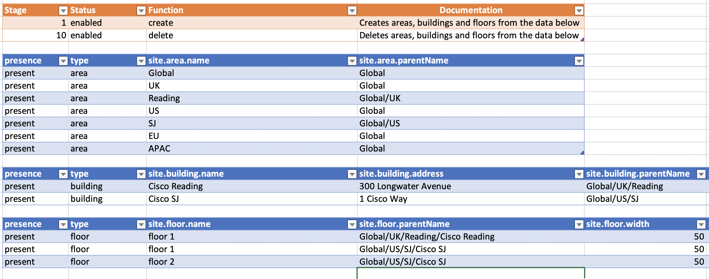
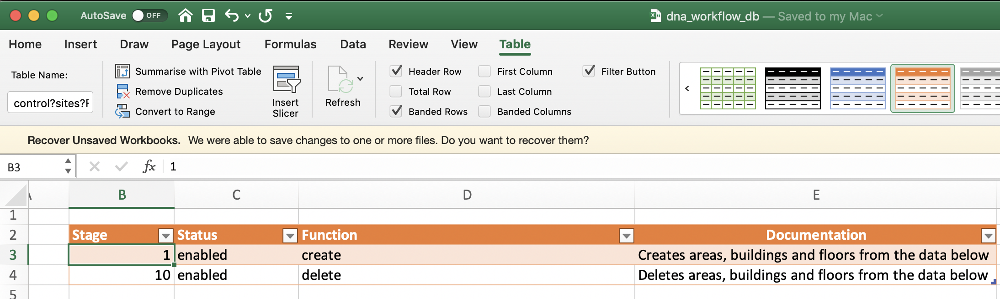

# DNA Workflows

First things first; ***We accept no responsability for any kind of loss or damage caused by using this arragnement of software code.  We also do not provide any promises or committment of support for said code.  It is pretty much all on you.***

DNA Workflows provides a framework for packaging and running DNA Center workflows and is losely based on the python [dnacentersdk](https://dnacentersdk.readthedocs.io/en/latest/#) package.

Workflows are written in python and added to the workflows DB (Excel workbook) where workflow input data and scheduling can be managed.

## Getting Started

The first thing you will need to do is clone this git respository and install the requirements using pip (Note: DNA Workflows requires Python 3).

```
pip3 install -r requirements.txt
```

The ```requirements.txt``` contains the requirements need to run the workflows included weith this repository.  However it is possible that new or custom workflows will require additional packages.

Once you have cloned this repo, open up the ```dna_workflow_db.xlsx``` workflow DB.  THe first sheet **workflows** is the master workflow control sheet.  The first table defines the credentials of the DNA Center that you will be working with.  The second table is a list of 'workflows', each one referencing another workflow sheet in the workbook.  Setting the status of the workflows to ```disabled``` in this second table will ... well, disable the execution of that workflow.

  

There is also a worksheet called ```control``` that is used to define lists for data validation.

The remaining worksheets define the individual workflows and the workflow sub-tasks.  The example below shows the ```sites``` workflow.



A key thing to note is that all data in the DNA Workflows DB is defined in Excel tables, and each table has a name that uniquely identifies that data set within the workbook.  If you highlight any cell in a table, the 'Table' menu appears at the top of the Excel window.  Selecting this menu, you will be able to see the table name.



When creating new workflows, it is probably good practice to use a fixed naming scheme for your tables especially if you want to be able to identify specific data schema in your workflows, but this is not a hard and fast rule so feel free to experiment.

We try to stick to the following naming schema;

```<type>?<description>?<keyColumn>```

Ok, so lets jump to getting DNA Workflows running:

 1. The first thing you will need to do is update the credentials in the ```workflows``` worksheet and save the workbook.
 2. Assuming that you have already installed the python requirements, you can run the workflows in No Operation mode (noop) like so;

```python3 dna_workflows.py --noop```

This will test connectivity to your DNA Center but will not execute any of the workflows.  Instead it will just log to console, letting you know which workflows are enabled on the master ```workflow``` worksheet.

```
CUNNINGR-M-X436:dna_workflows cunningr$ python3 dna_workflows.py --noop
2019-11-30 15:48:10,460 - main - INFO - Executing STAGE-1 workflow: sites::create
2019-11-30 15:48:10,460 - main - INFO - Executing STAGE-1 workflow: ip_pool::create_pools
2019-11-30 15:48:10,460 - main - INFO - Executing STAGE-1 workflow: discovery::create_global_credentials
2019-11-30 15:48:10,460 - main - INFO - Executing STAGE-1 workflow: discovery::delete_global_credentials
2019-11-30 15:48:10,460 - main - INFO - Executing STAGE-1 workflow: border_handoff::get_borders
2019-11-30 15:48:10,460 - main - INFO - Executing STAGE-2 workflow: ip_pool::create_reservations
2019-11-30 15:48:10,460 - main - INFO - Executing STAGE-2 workflow: reports::hello_world
2019-11-30 15:48:10,460 - main - INFO - Executing STAGE-2 workflow: discovery::run_discovery
2019-11-30 15:48:10,460 - main - INFO - Executing STAGE-2 workflow: discovery::delete_discovery
2019-11-30 15:48:10,460 - main - INFO - Executing STAGE-3 workflow: ip_pool::delete_reservations
2019-11-30 15:48:10,460 - main - INFO - Executing STAGE-4 workflow: ip_pool::delete_pools
2019-11-30 15:48:10,460 - main - INFO - Executing STAGE-10 workflow: sites::delete
2019-11-30 15:48:10,461 - main - INFO - Executing STAGE-10 workflow: reports::create_reports
```

Take this opportunity to disable any of the workflows that may do things that you do want to do right now.  Again, we take no responsability for any bad things may happen.

Something you may notice from the logging output is the ```Executing STAGE-X``` log message.  Since many workflows that we want to automate when deploying DNA Center have a strict order of dependancy, the DNA Workflows framework allows you to 'schedule' workflow sub-tasks in a specified order.  Now you know what the 'Stage' column does in a workflow control table (see example screenshot above).

The 'Stage' is really just an arbitrary integer so you can choose what you like and the workflow scheduling engine will simply execute the tasks in the DB in staged order (lowest first).  The default workflows are pre-configured to execute in the correct order.

## What does DNA Workflows provide?

In summary;

 * A workflow execution and scheduling engine.
 * A common logging framework.
 * Some common helper code that can be reused in your workflows.
 * A workflow database (Excel) used to control and provide external, structured data to your workflows.
 * Several example DNA Center workflows useful for common deployment and operations tasks.
 * Simple handing of API calls via the integrated [dnacentersdk](https://dnacentersdk.readthedocs.io/en/latest/#).
 * Script to automate adding of new workflows to your workflow DB.

Plans for the future (contributions appreciated);

 * Enhance the ```add_workflow.py``` to include import, export and delete of workflows

## Documentation

### Running Workflows

You can run ```dna_workflows.py``` with the following options;

 * Run with NoOp mode (testing): ```--noop```
 * Enable debugging level logs: ```--debug``` 
 * Run with a different workflow DB: ```--db <file>``` (default is dna_workflow_db.xlsx)

### Developing Workflows

You can add a new workflow to the (default) DB using the script ```add_workflow.py```

 * Create a new workflow template: ```--add-workflow <workflow-name>```
 * Delete a workflow from the DB: ```--delete-workflow <workflow-name>``` NOT YET IMPLEMENTED

When you add a new workflow using the script, you will see;

 1. A new row in the master ```workflows``` worksheet.
 2. A new worksheet for the added workflow with a new 'control' table.
 3. A new folder with basic 'Hello-World' workflow code.

Immediately after adding a new workflow, you should be able to execute ```python3 dna_workflows.py --noop``` and see your new workflow being staged for execution.


