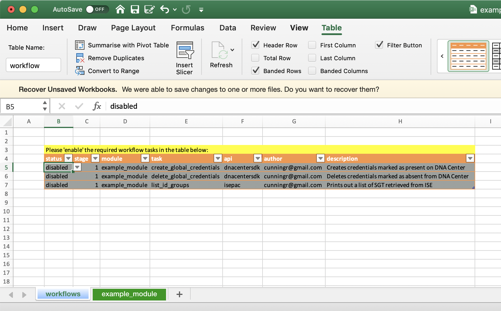

# DNA Workflows

This is the DNA Workflows project for the client and workflow engine code.  It provides a wrapper for publicly available Cisco SDKs and python libraries allowing users to develop 'Task' libraries and execute them using a simple linear workflow engine.

An example module providing a few sample tasks in [this project](https://github.com/cunningr/dna_workflows_example_module)

Currently integrated SDKs

 * [dnacentersdk](https://dnacentersdk.readthedocs.io/en/latest/#)
 * [ISE](https://github.com/falkowich/ise)

**The code is published here for demo purposes only and has had very little scrutiny for quality or security posture.**

## DNA Workflows Quick Start

You can install DNA Workflows using ```pip3```

```
pip3 install dna_workflows
```

A workflow is a user defined sequence of tasks and associated data passed to the workflow engine for execution.  For convenience, a workflow and all of its input data can be provided via an Excel workbook which is the recommended way to get started.  Workflows can also be converted from Excel to YAML to be maintained and executed directly from this format.

After installing DNA Workflows you should be able to use the script directly by typing ```dna_workflows -h``` in your shell;

```
# dna_workflows -h
usage: dna_workflows [-h] [--db DB | --yaml-db YAML_DB] [--profile PROFILE]
                     [--build-xlsx BUILD_XLSX]
                     [--build-test-xlsx BUILD_TEST_XLSX] [--manifest MANIFEST]
                     [--install] [--install-url INSTALL_URL]
                     [--install-zip INSTALL_ZIP]
                     [--update-xlsx-schema UPDATE_XLSX_SCHEMA] [--validate]
                     [--noop] [--offline] [--dump-db-to-yaml DUMP_DB_TO_YAML]
                     [--debug] [--persist-module-manifest]
                     [--add-module-skeleton] [--host HOST]

optional arguments:
  -h, --help            show this help message and exit
  --db DB               .xlsx file to use as the db
  --yaml-db YAML_DB     .yaml file to use as the db
  --profile PROFILE     Use this credentials profile
  --build-xlsx BUILD_XLSX
                        Builds a Excel workflow db based on the module
                        manifest
  --build-test-xlsx BUILD_TEST_XLSX
                        Builds a Excel workflow db based on the module
                        manifest with prepopulated test data
  --manifest MANIFEST   Used to specify a manifest file when building an xlsx
                        schema. Note that the modules must already be
                        installed or available from the current working
                        directory
  --install             Install packages using a manifest from the current
                        working directory
  --install-url INSTALL_URL
                        Install packages directly from URL. The URL must
                        provide a .zip archive for the package.
  --install-zip INSTALL_ZIP
                        Install packages directly from a .zip archive.
  --update-xlsx-schema UPDATE_XLSX_SCHEMA
                        Takes an existing Excel workflow DB and tries to
                        update the schema based on the latest module
                        definition
  --validate            Requests that the workflow engine validate the DB data
                        against module schema
  --noop                Run the scheduling logic but do not execute any
                        workflows
  --offline             Creates a 'dummy' api object, useful for workflow
                        development
  --dump-db-to-yaml DUMP_DB_TO_YAML
                        Creates an yaml file from provided *.xlsx workbook
  --debug               Enable debug level messages mode
  --persist-module-manifest
                        Do not clean up the .modules manifest
  --add-module-skeleton
                        Create a DNA Workflows module template
  --host HOST           Specify a host running the DNA Workflows Web App
```

The next thing you will need is a ```credentials``` file to tell DNA Workflows how to configure the SDKs that will connect to your systems.  You can find an example in this repository but it should look something like the below;

```
dnacentersdk:
    api_version: "1.3.0"
    base_url: "https://10.0.0.1"
    username: "admin"
    password: "cisco123"
    verify: False
isepac:
    host: '10.0.0.2'
    username: admin
    password: "cisco123"
    verify: False
    disable_warnings: True
```

Tip: You can also configure additional profiles (see main documentation TBD)

Note that the ```credentials``` file needs to be valid YAML.  Once you have updated the ```credentials``` file you should put it in a folder in your home dir called ```~/.dna_workflows/credentials```.  We recommend to adjust the permissions on the file appropriately (E.g. ```chmod 600```)

At this point you should be able to test connectivity to your API endpoint(s);

```
# dna_workflows --noop
2020-06-05 08:54:08,992 - main - INFO - API connectivity established with dnacentersdk
2020-06-05 08:54:08,993 - main - INFO - API connectivity established with isepac
2020-06-05 08:54:08,999 - main - INFO - Executing STAGE-1 workflow: noop::noop
```

Once you have validated that DNA Workflows can connect to your systems, you will need to load some workflow modules.  You can load modules;

 * Directly from a local folder containing the required packages and ```manifest.yaml``` file.
 * From a ```.zip``` archive containing the required packages and ```manifest.yaml``` file (E.g. a downloaded git repo).
 * Directly from a URL serving the required ```.zip```.  This can be done directly from Github for example.

There is a [sample module here](https://github.com/cunningr/dna_workflows_example_module) that can be installed like so;

```
dna_workflows --install-url https://github.com/cunningr/dna_workflows_example_module/archive/master.zip
```

This will download and install the modules according the ```manifest.yaml``` in ```~/.dna_workflows/install```.  Next you will need to generate the ```.xlsx``` workflow schema for (all) of your installed workflow modules;

```
dna_workflows --build-test-xlsx example.xlsx
```

**Note:** The above option will populate the schema with some example data.  If you want an empty schema you can use ```--build-xlsx``` instead.

This will create a new MS Excel file that contains a ```workflows``` worksheet and one (or more) module worksheets.  You may want to tidy up some of the column widths, but essentially your new workbook should like this;



Now you can go ahead and open up the ```example.xlsx``` and enable one or more of the tasks.  If you want to change the order in which enabled tasks are executed you can change the 'stage' value.


**WARNING:** The next step will make changes to your target system(s).

Once you are happy with the example configurations, save the ```.xlsx``` and run the workflow:

```
dna_workflows --db example.xlsx
```

If everything worked, the output should look something like this:

```
2020-08-27 14:31:06 - main - INFO - API connectivity established with dnacentersdk
2020-08-27 14:31:06 - main - INFO - Executing STAGE-1 workflow: examples::create_global_credentials
2020-08-27 14:31:06 - main.examples - INFO - examples::create_global_credentials::snmpWrite
2020-08-27 14:31:08 - main.examples - INFO - Creating SNMPV2_WRITE_COMMUNITY
2020-08-27 14:31:08 - main.examples - INFO - examples::create_global_credentials::snmpRead
2020-08-27 14:31:08 - main.examples - INFO - Creating SNMPV2_READ_COMMUNITY
2020-08-27 14:31:09 - main.examples - INFO - examples::create_global_credentials::cli
2020-08-27 14:31:09 - main.examples - INFO - Creating CLI credentials for username: dnacadmin
```

## Building a Workflow

On the 'workflows' worksheet you will find a table called 'workflow'.  By default the ```example_module``` module schema will set all the 'tasks' too 'disabled'.  Before enabling them, be aware that some of the **example tasks will make changes to your system (create/delete)** so please read the description and ensure you happy with the potential consequences.

The first thing to do is to identify the tasks that you are interested in and set them to enabled.  The next thing is to decide which 'stage' of execution you want the task to run in.  Execution of the tasks will happen in staged, sequential order.  Multiple tasks can be scheduled to the same stage however **no guarantee of order is given within a single stage**, which is fine for some tasks, but for tasks that depend on completion of previous tasks you will want to adjust the execution stage accordingly.


Now, moving to the example_module worksheet you will find some example data tables.  In this example there are three tables containing some DNA Center global credentials.  Take note of the Excel table names;


NOTE: These table names will be used as the key to identify each table once it is passed to the workflow functions (workflow tasks) and is derived from the module schema definition (see Creating a Module).  Each table will become a list of dictionaries (one per row) with the dictionary keys taken from the table headers.

If you have enabled an example task in the workflow db (Excel workbook) and saved it, you can execute the workflow like so;

```
dna_workflows --db example.xlsx
```

NOTE: Currently you will need to execute the workflow from the same directory that module is saved in.

```
# dna_workflows --db example.xlsx
2020-06-05 11:23:41,122 - main - INFO - API connectivity established with dnacentersdk
2020-06-05 11:23:41,122 - main - INFO - API connectivity established with isepac
2020-06-05 11:23:41,132 - main - INFO - Executing STAGE-1 workflow: example_module::create_global_credentials
2020-06-05 11:23:41,132 - main - INFO - Loading module example_module
2020-06-05 11:23:41,234 - main.example_module - INFO - example_module::create_global_credentials::snmpWrite
2020-06-05 11:23:42,017 - main.example_module - INFO - SNMPV2_WRITE_COMMUNITY exists with id: 5dd23c23-bea5-4bf8-8510-830b7a57eadd
2020-06-05 11:23:42,017 - main.example_module - INFO - example_module::create_global_credentials::snmpRead
2020-06-05 11:23:42,214 - main.example_module - INFO - SNMPV2_READ_COMMUNITY exists with id: 585248e2-d8db-405a-82e5-677849d75859
2020-06-05 11:23:42,214 - main.example_module - INFO - example_module::create_global_credentials::cli
2020-06-05 11:23:42,411 - main.example_module - INFO - CLI exists with id: 298d11c0-79c7-4646-86d4-93ec6ad2b61a
2020-06-05 11:23:42,417 - main - INFO - Executing STAGE-2 workflow: example_module::list_id_groups
2020-06-05 11:23:42,418 - main.example_module - INFO - example_module::list_id_groups
     name: GuestType_Weekly (default), uuid: 9efe2310-8c01-11e6-996c-525400b48521, description: Identity group mirroring the guest type
     name: Network Admins, uuid: fe23b320-2026-11ea-8912-86db5f756a5e, description:
     name: OWN_ACCOUNTS (default), uuid: a19d5f00-8c01-11e6-996c-525400b48521, description: Default OWN_ACCOUNTS (default) User Group
     name: GROUP_ACCOUNTS (default), uuid: a1bb2030-8c01-11e6-996c-525400b48521, description: Default GROUP_ACCOUNTS (default) User Group
     name: GuestType_SocialLogin (default), uuid: 28494140-2e58-11e9-98fb-0050568775a3, description: Identity group mirroring the guest type
     name: Employee, uuid: a1740510-8c01-11e6-996c-525400b48521, description: Default Employee User Group
     name: GuestType_Daily (default), uuid: 9eee92b0-8c01-11e6-996c-525400b48521, description: Identity group mirroring the guest type
     name: GuestType_Contractor (default), uuid: 9f048bb0-8c01-11e6-996c-525400b48521, description: Identity group mirroring the guest type
     name: ALL_ACCOUNTS (default), uuid: a176c430-8c01-11e6-996c-525400b48521, description: Default ALL_ACCOUNTS (default) User Group
```

## Creating a Module

DNA Workflow modules are designed to be fairly simple to develop and extend with the primary focus being on reusability. You can study the example module but essentially a module consists of two basic elements;

 * One or more public python functions (tasks) that takes exactly two arguments;
	 * An API class instance from one of the integrated SDKs.
	 * A python dictionary containing user data
 * A module schema (based on JSON schema) that describes;
	 * The available public python functions
	 * The format of the required user data

In order to get started creating your own modules you can use the ```--add-module-skeleton``` option to create the required files for a 'Hello World' package.  Immediately after generating the skeleton package you should be able to ```--install``` it and run the "Hello World" task.

Once you have DNA Workflows installed you can create a new skeleton module using the command below;

```
# dna_workflows --add-module-skeleton
Module name: example_module
email: cunningr@example.com
Successfully created the directory example_module
```

This will create the basic structure and example files for your new (python) module.  In fact, at this point you should be install the module and build the skeleton hello_world schema.

```
dna_workflows --install
dna_workflows --build-xlsx example.xlsx
```

and then run it like so;

```
# dna_workflows --db example.xlsx
2020-06-05 10:22:04,923 - main - INFO - API connectivity established with dnacentersdk
2020-06-05 10:22:04,924 - main - INFO - API connectivity established with isepac
2020-06-05 10:22:04,931 - main - INFO - Executing STAGE-1 workflow: example_module::hello_world
2020-06-05 10:22:04,932 - main - INFO - Loading module example_module
2020-06-05 10:22:04,975 - main.example_module - INFO - example_module::hello_world
hello_world.schema.example_module
{'presence': 'present', 'key1': 'value2', 'key2': True, 'example_tref': 'TWO'}
```

All this ```hello_world``` example is doing is printing a log to identify the task and then printing out the contents of the table named ```hello_world.schema.example_module``` from the workflow db.  You can open up the ```example.xlsx``` and play around with the status of the task in the workflow sheet and contents of the tables in your new ```example_module``` worksheet.

### Module Functions

Module functions (also known as tasks) are essentially public python functions written by the module developer and exposed via the module schema (see Module Schema).  The entry point for any code in your module is the ```workflow.py``` python file.  Essentially you can include whatever code you need in here (even imports to other python modules) however your public functions that you wish to expose to DNA Workflows users should take exactly two arguments, ```api```, and ```workflow_db```;

 * **api:** An API class instance from one of the integrated SDKs.
 * **workflow_db:** A python dictionary containing user data

These are the only two arguments that will be passed to your function from the DNA Workflows execution engine.

**HINT:** In the schema you will declare your public module functions along with the required ```api``` class (E.g. dnacentersdk, isepac et).

**HINT:** In the schema you will define the format of any user input your function requires.

Below is an example ```hello_world``` DNA Workflows function;

```
import logging
from module_name import payload_templates as templates
import yaml
import pkgutil

logger = logging.getLogger('main.module_name')


def get_module_definition():
    data = pkgutil.get_data(__package__, 'module')
    return yaml.load(data, Loader=yaml.SafeLoader)


def hello_world(api, workflow_dict):
    """ Prints hello_world and some test data from example schema.

    :param api: An instance of the XYZ SDK class
    :param workflow_dict: A dictionary containing rows of example data (see module);

    :returns: Nothing """
    
    _schema = 'hello_world.schema.module_name'
    logger.info('module_name::hello_world')
    logger.debug('schema: {}'.format(_schema))

    print(_schema)
    if _schema in workflow_dict.keys():
        table_data = workflow_dict[_schema]

        for row in table_data:
            print(row)
```

It is suggested that if you need to employ any complex payload templates (E.g. JSON payloads) that you use Jinja2, locating your templates in the file ```payload_templates.py``` as strings.

For a more complete example module please see the [DNA Workflows example_module](https://github.com/cunningr/dna_workflows_example_module)

### Module Schema

DNA Workflows uses the [sdtables](https://github.com/cunningr/sdtables) modules in order to build the Excel workbook from a JSON schema (stored as YAML) and adds some additional conditional formatting.  The schema describing the module is stored along with the module code in a file called ```module```.  The basic parts of the schema definition are described in the example below.

```
---
module:
  name: &module "module_name"     # Module name
  author: &author "me@example.com"    # Authors email
  # A description of the module will be inserted at the top of the Excel worksheet
  description: "This is default module description for module_name"
  # A list of provided public functions (Tasks).  These are inserted into the 'workflow' table
  methods:
    - {"status": "enabled", "task": "hello_world", "stage": 1, "module": *module, "api": "dnacentersdk",
       "author": *author,
       "description": "Runs the hello world task!"
    }
  # A dictionary of table schemas describing the table column names.
  # These will appear on the '<module-name>' worksheet and will create basic data validations
  # Table names take the form <schema-name>.schema.<module-name>
  # see https://github.com/cunningr/sdtables
  schemas:
    hello_world:
      description: "Used by: hello_world"
      properties:
        presence:
          type: string
          enum: ['present', 'absent']
        key1:
          type: string
          enum: ['value1', 'value2', 'value3']
        key2:
          type: boolean
        example_tref:
          type: string
          tref: 'INDIRECT("another_table.schema.module_name[testCol1]")'
    another_table:
      description: "A test reference table"
      properties:
        testCol1:
          type: string
        testCol2:
          type: string
  # Example data to populate the above schema.
  # In addition the data is also validated against the schema
  data:
    hello_world:
      - {'presence': 'present', 'key1': 'value2', 'key2': True, 'example_tref': 'TWO'}
    another_table:
      - {'testCol1': 'ONE', 'testCol2': 'AAAA'}
      - {'testCol1': 'TWO', 'testCol2': 'BBBB'}
      - {'testCol1': 'THREE', 'testCol2': 'CCCC'}
```

## FAQ

Q. How do I run the unittests?
A. ```pytest -o log_cli=true tests/unit/test_schema_operations.py```

 